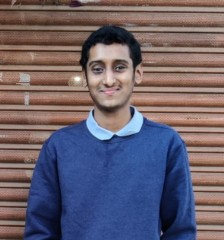

## Welcome to my home page!

Email: tejuprash@gmail.com
LinkedIn: https://www.linkedin.com/in/tejas-prashanth/

### About
I am an incoming Master's student at Purdue University. My broad research interests are in data systems and machine learning.  

### Research Interests
My current research interests are in Big Data Systems, especially for Data Science applications. I have had some undergraduate research experience in Hadoop, specifically in Spatial Hadoop. I have also been involved with research in the area of theoretical machine learning. 

### Publications
1. (In Submission) LipGene: Lipschitz continuity guided adaptive learning rates for fast convergence on Microarray Expression Data Sets
2. [Saha, S., Prashanth, T., Aralihalli, S., Basarkod, S., Sudarshan, T. S. B., & Dhavala, S. S. (2020, July). LALR: theoretical and experimental validation of lipschitz adaptive learning rate in regression and neural networks. In 2020 International Joint Conference on Neural Networks (IJCNN) (pp. 1-8). IEEE.](https://ieeexplore.ieee.org/abstract/document/9207650)
3. [Auradkar, P., Prashanth, T., Aralihalli, S., Kumar, S. P., & Sitaram, D. (2020). Performance tuning analysis of spatial operations on Spatial Hadoop cluster with SSD. Procedia Computer Science, 167, 2253-2266.](https://www.sciencedirect.com/science/article/pii/S1877050920307444)

### Professional Experience
I have 1.5 years of professional (including internship) experience as a Data Engineer in GE Healthcare. As part of the Data and Analytics team at GE Healthcare, I worked on implementing cloud-native tools to support data ingestion, as well as for improving overall platform operations and delivering relevant operational insights/metrics.  

My development experience has been primarily in implementing solutions in an AWS-centric ecosystem using Python. I have also worked with web application development using Python and Javascript during my internship period. 

As a Data Engineer, I have worked on developing tools using AWS S3, AWS DynamoDB and PostgreSQL. Moreover, I have also worked on development of proof-of-concept tools involving other AWS services such as AWS Glue, Elastic Map Reduce, Redshift and Step Functions.   

### Educational and Research Background
I have a Bachelor's of Technology (B.Tech) degree in Computer Science and Engineering from PES University, India. During my undergraduate program, I have had the following research experience:
1. *June 2018- July 2019*: Under the guidance of **Prof. Prafullata Auradkar** at the *Computer Science Department at PES University*, I worked with 2 other students on a research project involving analysis of performance of Spatial Hadoop using Solid State Drives. My research consisted of experimenting the use of Solid State Drives, in comparison with Hard Disk Drives, for various Map-Reduce based spatial operations. The research project resulted in 
2. *June 2019 - July 2019*: Under the guidance of **Prof. Hyong Kim** at the *Electrical and Computer Engineering Department at Carnegie Mellon University*, I worked on an exploratory research project involving determination of human positions and gestures using radio waves emitted by WiFi routers. My objective was to collect data and perform preliminary analysis on the data collected. 
3. *August 2019 - January 2021*: Under the guidance of **Prof. Snehanshu Saha**, who is currently a professor at the *Department of Computer Science and Information Systems at BITS Pilani, India*, I worked with 2 other students on a theoretical machine learning problem. The aim of the project was to mathematically derive a formula for learning rate for regression tasks to eliminate the need for hyperparameter tuning and to test its effectiveness on the speed of convergence of machine learning models. We derived LALR - Lipschitz Adaptive Learning Rate - for the Mean Absolute Error and Quantile Loss functions and experimented it with various datasets. The research work also involved experimentation with a genome dataset used for the task of Gene Expression Inference. 
